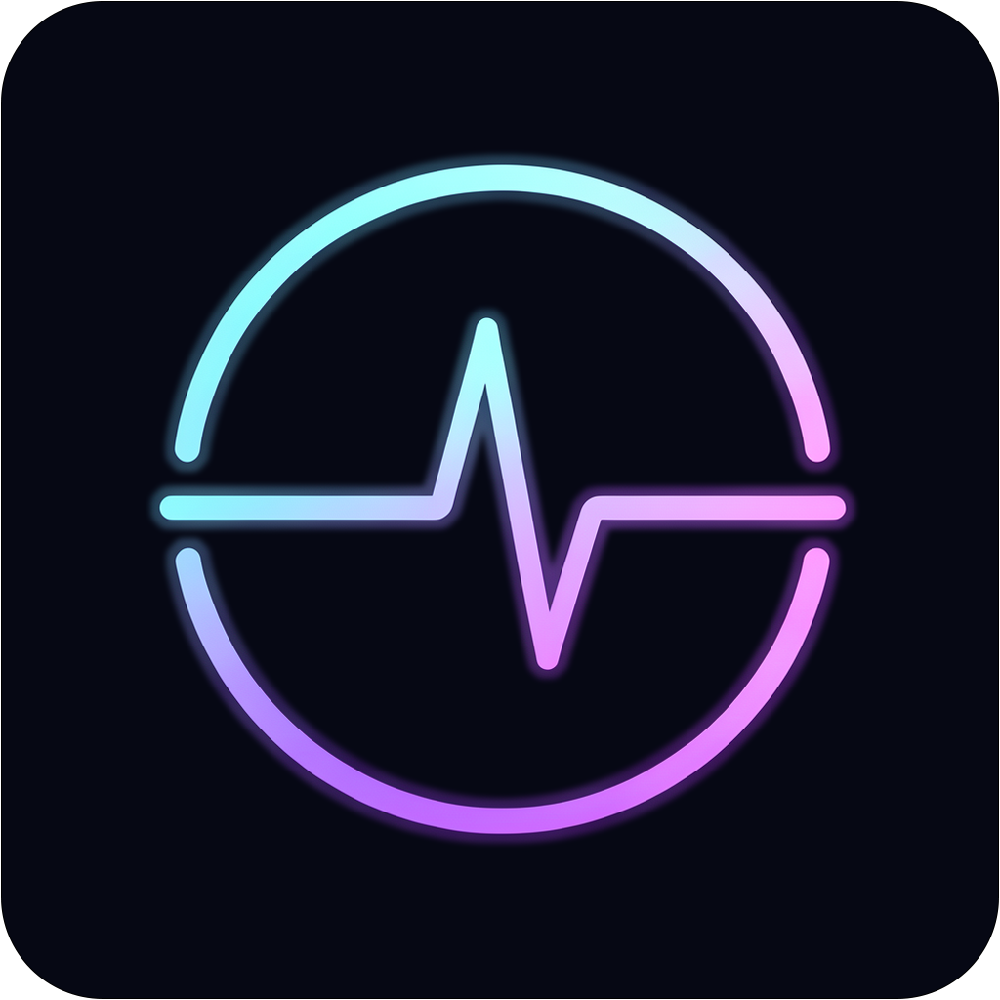
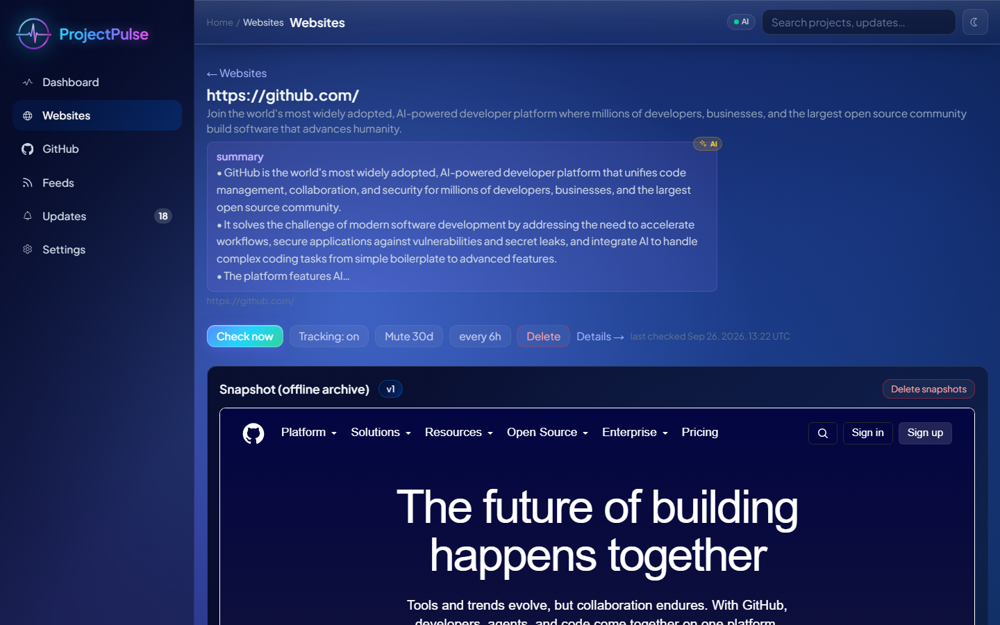
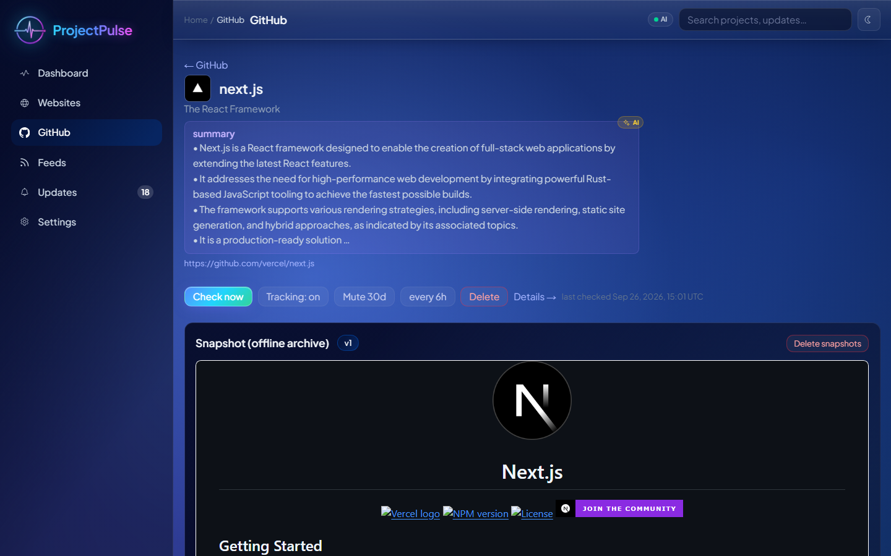
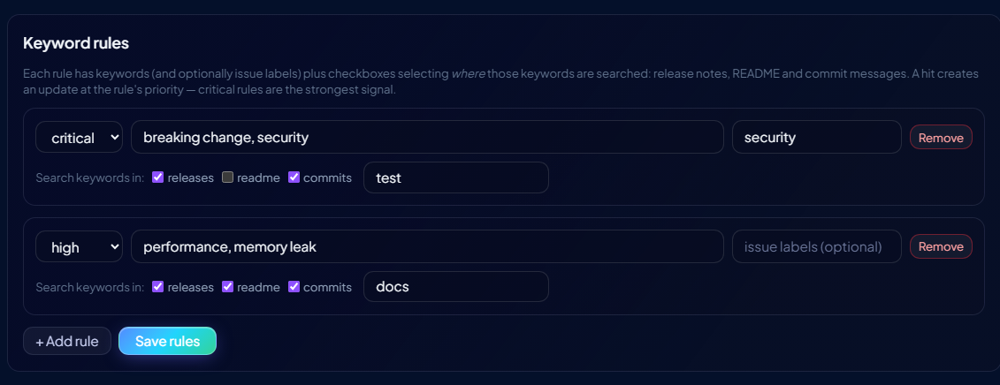
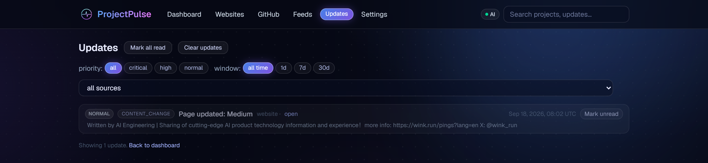
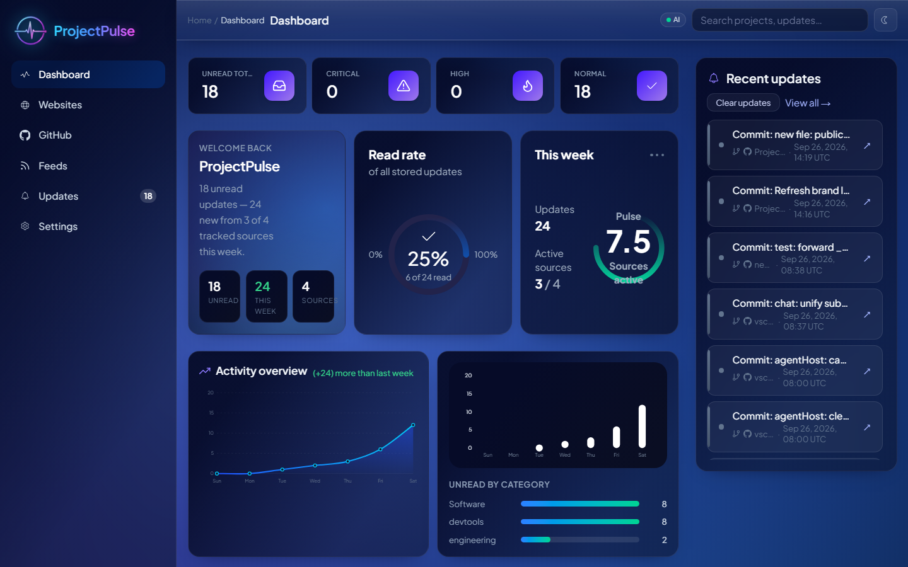
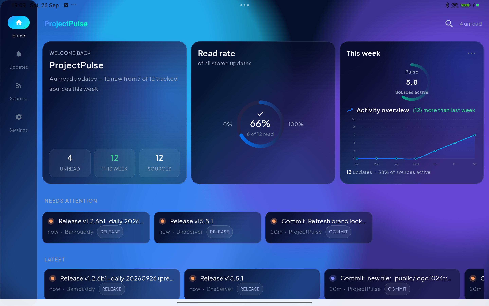
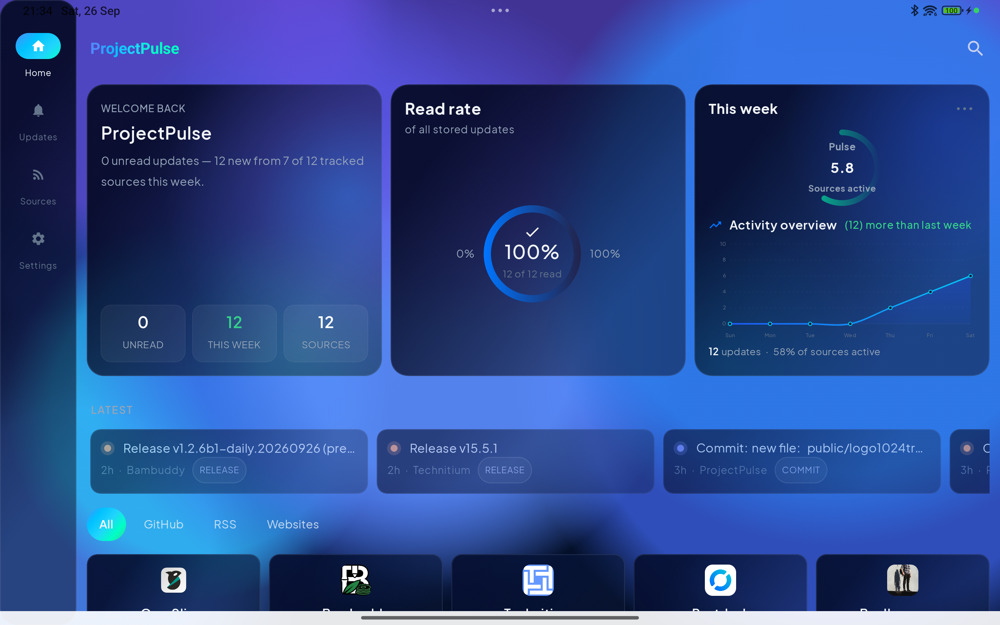
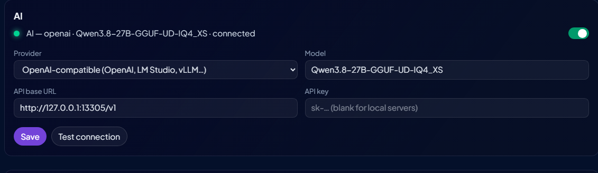

<p align="center">
  
</p>

<h1 align="center">ProjectPulse</h1>

<p align="center">
  A self-hosted tracker for projects: snapshot and watch project websites,<br/>
  follow GitHub releases and milestones, and monitor RSS/Atom feeds — with<br/>
  priority keyword rules, optional local AI, push alerts (webhook / ntfy /<br/>
  Telegram / email) and a native <b>Android companion app</b>.
</p>

<p align="center">
  
  
  
  
  
  
</p>

<p align="center">
  
  
  
</p>

<p align="center">
  <a href="https://pantera87.github.io/ProjectPulse">Landing page</a>
</p>

<div align="center">
  <hr/>
  <p>
    <a href="#features">Features</a>
    <span>&nbsp;·&nbsp;</span>
    <a href="#android-app">Android app</a>
    <span>&nbsp;·&nbsp;</span>
    <a href="#how-it-works">How it works</a>
    <span>&nbsp;·&nbsp;</span>
    <a href="#alerts">Alerts</a>
    <span>&nbsp;·&nbsp;</span>
    <a href="#getting-started">Getting started</a>
    <span>&nbsp;·&nbsp;</span>
    <a href="#configuration">Configuration</a>
    <span>&nbsp;·&nbsp;</span>
    <a href="#ai-optional">AI (optional)</a>
    <span>&nbsp;·&nbsp;</span>
    <a href="#local-development">Local development</a>
    <span>&nbsp;·&nbsp;</span>
    <a href="#project-structure">Project structure</a>
  </p>
  <hr/>
</div>

## Features

- **Offline snapshots** — save project websites for later: captured HTML rendered in a sandboxed iframe, with images/styles/scripts archived for fully offline rendering ("full" mode); history depth and storage mode configurable in Settings.

  

- **Change tracking** — scheduled checks detect page changes; every change produces a new snapshot version plus an update entry with a text diff.
- **GitHub tracking** — keywordless change tracking (new releases / README changes / new commits — per-repo toggles), milestones, issue-label watching, and README/commit keyword scans.

  

- **Feeds** — RSS/Atom feeds as first-class sources.
- **Priority keyword rules** — word-boundary matching with negation and priorities (e.g. flag anything mentioning *kernel, linux* as *critical*), plus an optional AI semantic second pass.

  

- **Two-level category classification** — a generic category and a specific subcategory, auto-assigned from project content: keyword hints first, and when no keyword matches the AI reads the full page/feed content.
- **Optional AI** — change summaries, importance classification of updates, goal extraction, semantic keyword matching, category assignment, and project summaries. Local Ollama, OpenAI-compatible, Anthropic, or MCP providers; the app is fully functional without it.
- **Updates feed** — priority-sorted, digest time windows, muting, full-text search (SQLite FTS5), and JSON backup/restore.

  

- **Dashboard** — activity overview (7-day chart, week-over-week delta, sources active this week), unread-by-category and per-project stat tiles with 7-day sparklines.

  

- **Alerts** — push new updates to **webhook, ntfy, Telegram or email**; per-channel minimum priority and update-kind filters, a test send, and a delivery log in Settings → Alerts.
- **Android companion app** — native Kotlin/Jetpack Compose app, **optimized for both phones and tablets**: dashboard, updates, sources, search, snapshots, add source and keyword rules, plus background sync with local notifications ([details](#android-app)).
- **Two themes** — *Aurora* (blue, reference) and *Pulse* (classic violet) share one design language between the web app and the Android app.

## Android app

A native **Kotlin / Jetpack Compose** companion app (in `android/`),
**optimized for both mobile phones and tablets** — the layout adapts to the
screen and orientation. It talks to your ProjectPulse server over the network
— LAN `http` or `https`; login is reused from the server's auth. There is no
server push: a WorkManager job polls the server on the interval you pick
(default 15 min) and posts local notifications for new updates (one
persistent notification, always the latest).

- **Phones & tablets** — fully adaptive Compose layout: compact cards and a
  bottom navigation bar in portrait on phones; wider multi-column grids and a
  persistent side rail on tablets and in landscape.
- **Dashboard** — aggregate stats (total updates, sources, this week's
  activity), a 7-day activity chart and the project grid, with unread counters.

  
  

- **Updates** — the same priority-sorted feed as the web app: pagination,
  pull-to-refresh, priority badges and the full update detail (summary, diff,
  links).
- **Sources** — list with per-source logos, detail page with an offline
  snapshot viewer (WebView), **add source** (website / GitHub / feed) and the
  **keyword rules editor** — all from your phone.
- **Search** — full-text search over projects and update history.
- **Settings** — server address, notification toggle + interval, and the
  Aurora / Pulse theme (matching the web app); adaptive launcher icons and a
  minified R8 release build.

### Building & installing

```bash
cd android
./gradlew assembleDebug     # debug APK → app/build/outputs/apk/debug/
./gradlew assembleRelease   # minified (R8) release build
```

Install the APK by sideloading (copy it to the device, or
`adb install app/build/outputs/apk/debug/app-debug.apk`). There is no Play
Store distribution — build it once and you're done.

## How it works

### Websites

- **Add a URL** → an HTML snapshot is captured immediately (read offline,
  rendered in a sandboxed iframe; history depth and storage mode — "full" with
  the page's assets archived for fully offline rendering, or HTML-only — are
  configurable in Settings).
- **Track updates**: a scheduled check extracts the page's main text,
  normalizes it and hashes it. On change: a new snapshot version is stored and
  an update entry with a text diff is created. The check always looks at the
  current content of the tracked page itself (its own feed, if any, is
  ignored) — so an update is only raised when that specific page changes.
- **Keyword rules** per site: e.g. a critical rule `kernel, linux` → the moment
  those words appear in newly added page text, the update is *critical*. With
  AI enabled, a semantic second pass also flags text that *relates to* the
  rule's topics without using the exact words.
- **Goal extraction**: the project's one-line purpose is auto-extracted
  (meta description → first paragraph) and editable.

### GitHub

- Add as `owner/repo` or a GitHub URL.
- **Track changes** (per-repo toggles, no keywords needed) — each creates an
  update on the event itself:
  - *New releases* (on by default) — every new release/tag.
  - *README changes* — the README is hashed; on change an update with a text
    diff of what was added.
  - *New commits* — every new commit in the default branch.
- New **releases/tags** → update entries (unless the toggle is off and no
  keyword rule matches). Priority:
  - keyword rule match in release notes → the rule's priority (e.g. *critical*)
  - semver **major bump** or "stable/1.0" in the title → *high*
  - otherwise → *normal*
- **Milestones**: newly opened or completed GitHub milestones → *high*.
- **Label watching**: add issue labels to a rule (e.g. `linux`) — new open
  issues/PRs with that label are flagged at the rule's priority.
- **State-change scans**: the README and the last 30 commits are scanned for
  keywords; you get one alert when a keyword *newly* appears (e.g. a watched
  keyword shows up in the README → instant critical alert). The alert links
  directly to the match: the commit whose message contains the keyword, or the
  README section it appears in.
- **Rate-limit friendly**: each check first polls the repo's `releases.atom`
  feed — a plain endpoint *outside* the API rate limit. If it is unchanged and
  nothing else is being watched, the cycle only fetches milestones instead of
  releases, README, commits and issues.
- Unauthenticated GitHub API: 60 requests/h per IP. Set `GITHUB_TOKEN` — or
  save a token in **Settings → GitHub** (verified against the API before it is
  stored) — for 5000/h.

### Feeds (RSS/Atom)

RSS/Atom feeds are first-class sources — often the most reliable way to track
a project's changelog. New entries land in the updates feed; keyword rules
apply.

### Keyword rules

- Match on word boundaries (negation supported) with a priority per rule.
- The keyword matcher **always runs first** on every update; when AI is
  enabled, a semantic second pass only *adds* matches for text that relates to
  the rule's topics — it never vetoes keyword hits.
- Rules can attach to websites (new page text) and GitHub (release notes,
  issue labels, README/commit scans) as described above.

### Category classification

Every source type gets a two-level classification, auto-assigned:

- **Generic category** — the broad domain/family (e.g. `ai`)
- **Subcategory** — the specific one (e.g. `inference-engine`)

- AI assigns both levels when available; the dashboard groups projects by category.
- A cheap keyword **pre-pass** over the repo's **topics** (then topics +
  **about**) runs BEFORE any AI call — a confident topic match assigns the
  category with zero model calls; only a miss falls through to the cascade.
- **GitHub** sources use a priority cascade over the repo's own signals: its
  **topics** first, then topics + **about** section, and only when neither
  gives a confident answer is the **full README** ingested (the stored AI
  summary can substitute for the README when it is already present).
- **Websites and feeds**: keywords are checked first (fast, no AI latency);
  when no keyword matches, the AI reads the full page/feed text and assigns
  both levels. The full content is fetched whenever the stored goal/summary
  is too thin to classify from (a project name alone is not content).
- **Without AI**, the keyword-hint pass assigns only the generic category —
  not very accurate, so those are marked with a "guessed" hint in the UI.
- Missing levels are **backfilled automatically on every check** (a
  subcategory left empty is completed by AI on a later check), and keyword
  guesses are re-classified by AI on a later check once it becomes available.
- A category that simply repeats the project name (a known weak-model failure
  when it was given too little content) is treated as invalid and
  re-classified from content on the next check.
- Values set by AI or by the user are otherwise **never overwritten**, and both
  levels are always editable.
- **Per-category icons** — when classifying, the AI also picks the glyph that
  best represents the new category from a curated ~300 stroke icons of the
  Iconify ["Glyphs"] set (MIT), bundled at build time in
  `src/lib/glyphs.generated.ts` — zero runtime network dependency. The pick
  is stored once per category (`categories` table) and the dashboard renders
  every category's gradient tile with it. Without AI (or when the model
  picked nothing valid) the tile falls back to keyword rules / a
  deterministic hash, exactly as before. Extend or refresh the bundled set
  with `npm run icons:fetch`.

### Updates feed & dashboard

- Priority-sorted (critical first), filter by priority / source / time window
  (1d / 7d / 30d digests), mark read/unread, mute a source for 30 days.
- The dashboard groups projects by category (extracted goal) as stat tiles —
  7-day activity sparkline, unread count and a "+N since last check" badge —
  above an **activity overview** (7-day activity chart, updates this week with
  the week-over-week delta, sources active this week) and unread counters per
  priority and category.
- Full-text search over project goals/names and update history (SQLite FTS5),
  from the dashboard search box or the dedicated `/search` page.
- **Backup/restore**: download the whole database as JSON, restore later
  (Settings page) — handy across a TrueNAS migration.

### Alerts

Every new update fans out to all enabled channels — **webhook** (a short JSON
message), **ntfy**, **Telegram** or **email** (SMTP) — configured in
Settings → Alerts:

- Per-channel **minimum priority** (critical / high / normal) and an optional
  update-kind whitelist, so e.g. only *critical* GitHub events reach your
  phone.
- **Send test** per channel, and a **delivery log** of the recent attempts
  (status / error / attempts) — failures are visible instead of silent.
- Delivery is best-effort and non-blocking: one retry with a short backoff,
  logged either way.
- `WEBHOOK_URL` in the environment acts as an extra always-on webhook channel
  until you save a webhook channel in the UI.

## Getting started

### Docker Hub (pre-built image)

```bash
docker run -d --name projectpulse -p 4701:4701 -v pp_data:/data \
  pantera87/projectpulse:latest
# open http://localhost:4701
```

The image is published to [Docker Hub](https://hub.docker.com/r/pantera87/projectpulse)
on every release. No Ollama bundled here — point the app at your own
(`OLLAMA_URL`) or pick a remote provider in Settings, or use the compose setup
below which includes one.

### Docker Compose (with bundled Ollama)

```bash
docker compose up -d --build
# open http://localhost:4701
```

AI runs out of the box on the bundled **Ollama** container: the compose file
sets `OLLAMA_URL=http://ollama:11434` (the service name on the Docker network
— no IP to look up), and `ollama-init` pre-downloads the default model
(`qwen3.5:4b`, override with `OLLAMA_MODEL`) once the server is up.
Downloaded models persist in the `ollama_data` named volume. To use a remote
provider instead, remove the two `ollama*` services from the compose file and
pick the provider in Settings. If your Ollama server lives elsewhere (e.g. on
the Docker host), Settings → AI has a **Detect Ollama address** button that
probes the common endpoints and fills in the one that answers.

All data (SQLite DB + snapshots) lives in the `projectpulse_data` named
volume; Ollama's models live in the `ollama_data` named volume.

### TrueNAS SCALE (Portainer)

The compose file is written for **Portainer stacks**, which cannot run
`build:` — so build the image once on the host first:

1. Copy the project folder (or the repo) to a path on TrueNAS.
2. Enable SSH (System → Network & Services) and build the image:
   ```bash
   cd /path/to/ProjectPulse
   docker build -t projectpulse:latest .
   ```
3. In **Portainer → Stacks → Add new stack**, paste (or upload) the
   `docker-compose.yml`, give the stack a name, and hit **Deploy**.
4. Open `http://<truenas-ip>:4701`.

Notes:

- Data uses **named Docker volumes** (`projectpulse_data`, `ollama_data`) —
  Portainer manages them, so there is no host-path/permission (`mkdir`)
  problem. Back them up via Portainer (Volumes → Download) or with the
  in-app JSON backup (Settings page).
- The `ollama-init` container shows **Exited (0)** after it runs — that's
  its one-shot job (pre-pulling the model) done.
- To upgrade: replace the project files, run `docker build -t
  projectpulse:latest .` again, then **Update** the stack in Portainer.
  The named volumes are untouched.
- All configuration goes directly into the compose file (Portainer has no
  `.env` file) — uncomment the variables in the `projectpulse` service.

## Configuration

All extras are env-driven and off by default:

| Variable | Effect |
|---|---|
| `AUTH_PASSWORD` | enables a login screen (single shared password) |
| `TZ` | IANA timezone (e.g. `Europe/Athens`) for the scheduler, log timestamps and the times shown in the UI — the UI picks it up automatically after a container restart |
| `WEBHOOK_URL` | extra always-on webhook channel — POSTs every new update as a short JSON message `{title, url, summary}` (the AI's plain-prose summary of the major changes, no bullets); Settings → Alerts can add more channels (ntfy, Telegram, email) |
| `OLLAMA_URL` / `OLLAMA_MODEL` | AI via local Ollama (see [AI](#ai-optional)); the compose file sets `OLLAMA_URL` to the bundled service by default |
| `OLLAMA_KEEP_ALIVE` | minutes a model stays loaded after use before Ollama frees the RAM (default 5; also settable in Settings) |
| `OPENAI_URL` / `OPENAI_API_KEY` | AI via any OpenAI-compatible endpoint |
| `ANTHROPIC_API_KEY` | AI via Anthropic (Claude) |
| `MCP_URL` | AI via a remote MCP server (Streamable HTTP) |
| `GITHUB_TOKEN` | higher GitHub API rate limit |
| `SCHEDULER_INTERVAL_MINUTES` | scheduler wake-up cadence (default 5) |
| `SNAPSHOT_KEEP_VERSIONS` | snapshot history depth (default 10; also settable in Settings → Snapshots & summaries) |

> **Security note:** if you store API keys in Settings and the app has no
> `AUTH_PASSWORD`, anyone with network access can read them — enable the shared
> password for non-localhost deployments.

## AI (optional)

AI powers five features:

1. **Summaries of changes** — a one-line summary of each new update
2. **Goal extraction** — for pages without descriptions
3. **Semantic keyword matching** — the keyword matcher always runs first; AI
   only adds matches it never vetoes
4. **Two-level category assignment** — by intended use (generic category +
   specific subcategory), reusing existing categories for dashboard grouping
5. **Project summary** — generated when a project is added (shown on project
   cards and detail pages)

All AI calls are background/non-blocking with heuristic fallbacks — the app is
fully functional without it.

### Providers

Configurable in Settings → AI, or via env as defaults:

| Provider | What it needs | Notes |
|---|---|---|
| **Ollama** (default) | bundled `ollama` service in `docker-compose.yml` — `OLLAMA_URL` is set to `http://ollama:11434` by default (auto-detected in Settings if Ollama lives elsewhere) | Local models (`qwen3.5:4b` default — the best quality-to-size balance for CPU; the Settings catalog has smaller (basic) models, larger (very accurate) ones and a power option; override with `OLLAMA_MODEL`, pre-pulled on container startup by `ollama-init`). Models load on first use. |
| **OpenAI-compatible** | base URL (+ key for hosted APIs) | OpenAI, LM Studio, vLLM, Ollama's `/v1`, any gateway. |
| **Anthropic** | API key | Claude via the Messages API. |
| **MCP** | MCP server URL (Streamable HTTP) | Run the AI on another machine (e.g. a desktop with a GPU) and point ProjectPulse at an MCP server there; tool + argument are auto-detected (or set explicitly). |

### Model manager (Ollama)

Settings → AI lists a curated catalog of models (the standard Q4_K_M
builds) with their size, context, an accuracy hint (*power* MoE for
RAM-rich servers / *very accurate* 8B+ / *moderately accurate* 3–4B /
*basic* ≤ 2B) and a hardware-fit hint for *this* server (based on system
RAM — Node cannot read VRAM).



- Status per model: *installed / loaded / downloading %*
- One-click **Download** and **Delete** per model, plus **Unload** to free RAM
  on demand
- **Live Ollama server log** — the bundled container tees its output to a
  shared volume the app reads from, so Settings → AI shows the real server log
- **Delete all models & reset AI** — wipes every installed model and starts
  over from the default
- Before README text is handed to a model, badges, images, inline HTML and
  license headers are stripped so prompt contexts stay minimal (CPU prompt
  ingestion scales linearly with length)

### RAG (Ollama ≥ 0.6.2 only)

Instead of truncating long documents into the prompt, ProjectPulse hands the
full project content (README / page text / feed) to Ollama's built-in RAG —
the server chunks, embeds and retrieves from it, so the model only sees the
most relevant parts. Used by category classification, project summaries, goal
extraction and the semantic keyword pass. On older Ollama versions (or
non-Ollama providers) the calls degrade to the in-prompt truncated prefix.
Settings shows *RAG ready / RAG off* for the Ollama server.

### Auto-download (the only automatic download)

If AI is enabled and the selected Ollama model is not on the machine,
ProjectPulse starts the pull automatically the next time AI is used (e.g. when
you add a project); the navbar badge then shows the download percentage, and
the pending summary is retried on the next scheduled check. Every other model
is downloaded manually.

### Toggle & test

- `AI_ENABLED=false` is a hard kill-switch (the UI toggle can re-enable only
  when this is not set).
- A **Test connection** button in Settings runs a trivial generation through
  the active provider.
- If the Ollama connection is broken, Settings → AI looks for the server
  automatically (**Detect Ollama address** probes the bundled compose service,
  local loopback and the Docker host) and offers one click to use the address
  that answers. A stored address that stops answering (e.g. a host loopback
  saved before the compose service existed) is also **self-healed
  automatically**: the app probes the known endpoints once and persists the
  one that answers — no extra polling (zero cost in steady state, ~3 tiny
  probes/minute at worst).
- The navbar badge always shows the AI state: off / not configured /
  downloading / ready (model loaded).

## Local development

```bash
npm install
npm run dev        # http://localhost:4701, data in ./data
npm run build      # production build
npm run icons:fetch  # refresh the bundled category glyph set (offline once generated)
```

## Project structure

- `src/lib/db.ts` — SQLite schema (sources, snapshots, updates, FTS index)
- `src/lib/checkers/{website,github,rss}.ts` — per-type checkers
- `src/lib/rules.ts` — keyword rule engine (word-boundary, negation,
  priorities) + `findRuleHitSmart` (keyword pass first, optional AI
  semantic second pass)
- `src/lib/scheduler.ts` + `src/instrumentation.ts` — in-process scheduler
- `src/lib/ai.ts` — AI provider seam (Ollama, OpenAI-compatible, Anthropic,
  MCP) with per-feature fallbacks; `src/lib/ollama.ts` — Ollama client,
  model catalog + hardware hints, download registry
- `src/lib/project-context.ts` — gathers the full project content (README +
  meta for GitHub, page text for websites, feed text for RSS) for the AI
  summary + content-based category classification;
  `src/lib/project-summary.ts` — stores the AI summary (triggered on add +
  backfilled on first check); `src/lib/category.ts` — AI two-level category
  auto-assignment (generic category + subcategory) from project content
  (GitHub: tiered topics → about → full README, README only ingested when
  the light tiers are unsure; RAG document for the full tier) with
  keyword-hint fallback (backfilled on add + first check; name-echoing
  values are re-classified); `src/lib/category-icons.ts` — per-category
  AI-picked icon (stored in the `categories` table);
  `src/lib/glyphs.generated.ts` — bundled curated Iconify "Glyphs" bodies
  (regenerate with `npm run icons:fetch`)
- `src/lib/notifiers.ts` — alert fan-out: webhook / ntfy / Telegram / email
  channels with priority + kind filters, retries and a delivery log
- `src/lib/archive.ts` — offline snapshot archiving (downloads a page's assets
  and rewrites the HTML to local URLs)
- `src/lib/dashboard-aggregates.ts` — dashboard hero stats + 7-day activity
- `src/middleware.ts` — optional password auth gate
- `android/` — native Android companion app (Kotlin, Jetpack Compose,
  WorkManager background sync + local notifications)
- API routes under `src/app/api/` mirror the pages; UI is Next.js App Router
  with server components reading SQLite directly.

## License

[MIT](LICENSE) — free to use, modify and distribute, with or without
modification, for any purpose, with attribution.


